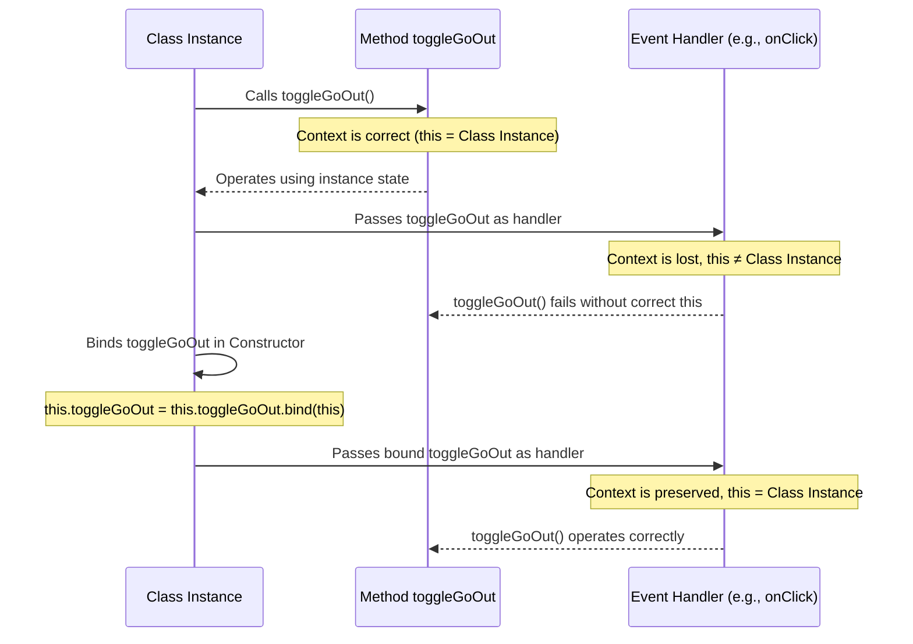
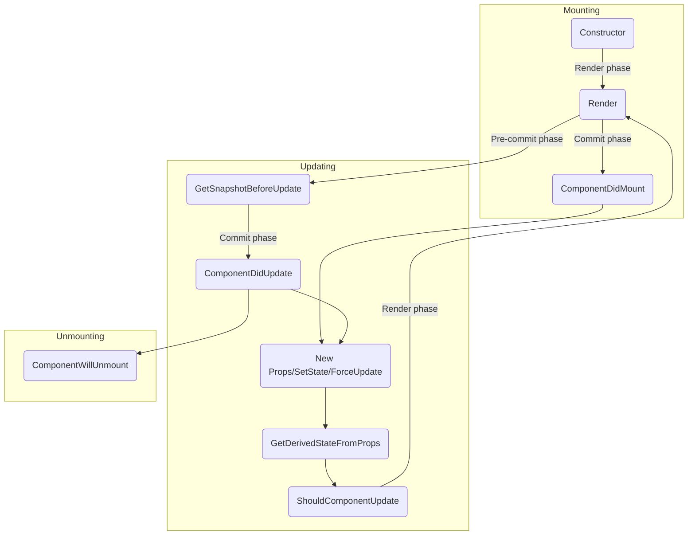

# Classes in React.JS

[Learning with Scrimba](https://www.youtube.com/playlist?list=PLqYFXd9GTRVUE1mKTvVAPqtVzLbRTnm_L).

## An abbreviated review of ES6 classes

Won't be looking at prototypes, prototype chains, inheritance, constructor functions and more. (Which is fine, classes are fundamentally similar across all languages anyway)

`A "class" in JavaScript is a blueprint for creating objects that have the same properties and references to the same methods`

### Class basics

- For our purposes, it's important to know that classes are just "syntactic sugar" on top of setting up constructor functions and prototype chains manually.
- In react specifically, we will see examples of "Class fields" which is a way in a class to initialise every object that is created from the class with the same value.
- If we need to initialise a class with a dynamic property, the `constructor()` method must be used to instantiate it.
- We can use inheritance in react to allow the child class to access methods from parent class.

## Props in Class components

```jsx
// App.jsx
import React from "react"; // import React, {Component} from "react"; < Alternative using destructured imports

// export default function App(props) {
//   return {
//     <h1>{props.type} component</h1>;
//   }
// } // ^ Functional

// class App extends Component { // < Alternative using direct reference
export default class App extends React.Component {
  render() {
    return {
      <h1>{this.props.type} component</h1>;
    }
  }
}
```

```jsx
// index.jsx
import React from "react";
import ReactDOM from "react-dom";
import App from "./App";

ReactDOM.render(<App typ="Class" />, document.getElementById("root"));
```

## Convert functional components into class components

```jsx
import React from "react";
import ReactDOM from "react-dom";

/*

Challenge:
1. Convert all 3 components to be class-based
2. Fix the small bug

*/

// #1

class App extends React.Component {
  render() {
    return (
      <div>
        <Header username="mj" />
        <Greeting />
      </div>
    );
  }
}

// #2
class Header extends React.Component {
  render() {
    return (
      <header>
        <p>Welcome, {this.props.username}!</p>
      </header>
    );
  }
}

// #3
// Hint: any "display logic" can be placed inside the `render`
// method before the `return` statement
class Greeting extends React.Component {
  render() {
    const date = new Date();
    const hours = date.getHours();
    let timeOfDay;

    if (hours < 12) {
      timeOfDay = "morning";
    } else if (hours >= 12 && hours < 17) {
      timeOfDay = "afternoon";
    } else {
      timeOfDay = "night";
    }
    return <h1>Good {timeOfDay} to you, sir or madam!</h1>;
  }
}

ReactDOM.render(<App />, document.getElementById("root"));
```

## State in class components

```jsx
import React from "react";

export default class App extends React.Component {
  // const [goOut, setGoOut] = React.useState("Yes")

  state = {
    goOut: "Yes",
  };

  toggleGoOut() {
    setGoOut((prevState) => {
      return prevState === "Yes" ? "No" : "Yes";
    });
  }

  render() {
    return (
      <div className="state">
        <h1 className="state--title">Should I go out tonight?</h1>
        <div className="state--value" onClick={this.toggleGoOut}>
          <h1>{this.state.goOut}</h1>
        </div>
      </div>
    );
  }
}
```

## Setting state in class components

```jsx
import React from "react";

export default class App extends React.Component {
  /**
   * A class component with state will ALWAYS save state in a class
   * instance variable called `state`, which will always be an object.
   * The individual values you save in state will be properties on
   * the `state` object.
   *
   * The simplest (and more modern) way to delcare new state in a
   * class component is to just use a "class field" declaring state
   * as an object, like you see below.
   *
   * Then, throughout the rest of the component (e.g. inside the render
   * method) you can access that state with `this.state.<yourPropertyHere>`
   */

  state = {
    goOut: "Yes",
  };

  /**
   * Any class methods you create that need to call the `this.setState`
   * method (which is available to our component because we're extending
   * React.Component) should be declared as an arrow function, for
   * reasons we will discuss soon. (Note: other class methods you
   * want to make that DON'T use `this.setState` don't necessarily
   * need to be declared as arrow function to work correctly)
   */
  toggleGoOut = () => {
    this.setState((prevState) => {
      return {
        goOut: prevState.goOut === "Yes" ? "No" : "Yes",
      };
    });
  };

  render() {
    return (
      <div className="state">
        <h1 className="state--title">Should I go out tonight?</h1>
        <div className="state--value" onClick={this.toggleGoOut}>
          <h1>{this.state.goOut}</h1>
        </div>
      </div>
    );
  }
}
```

## Code challenge:

```jsx
import React from "react";

/**
 * Challenge: Convert this stateful function component
 * to a stateful class component. At the end, everything
 * should work exactly the way it does now.
 *
 * 1. Change the syntax to a class component
 * 2. Declare state in the class component that
 *    can hold the value of `count`
 * 3. Update the add and subtract methods so you won't
 *    get the error about calling `setState` on undefined
 * 4. Update the values in the render method to account
 *    for the changeover to a class component
 */

export default class App extends React.Component {
  // const [count, setCount] = React.useState(0)

  state = {
    count: 0,
  };

  add = () => {
    this.setState((prevState) => {
      return {
        count: prevState.count + 1,
      };
    });
  };

  subtract = () => {
    this.setState((prevState) => ({ count: prevState.count - 1 })); // implicit return statement ({RETURN_BODY})
  };

  render() {
    return (
      <div className="counter">
        <button className="counter--minus" onClick={this.subtract}>
          –
        </button>
        <div className="counter--count">
          <h1>{this.state.count}</h1>
        </div>
        <button className="counter--plus" onClick={this.add}>
          +
        </button>
      </div>
    );
  }
}
```

## Constructor method in class components

Here, Bob explains that he has covered a modern syntax for class components, and that an even more fundamental approach is possible by using the javascript `constructor()` built-in method.

```jsx
import React from "react";

export default class App extends React.Component {
  /**
   * If you can't use class fields in your class components
   * for some reason, then you'll need to make use of the
   * class' `constructor` method to initialize your state object.
   * The first line of the constructor method should be a call
   * to `super()` like you see below, and then you can add your
   * state variable as a property attached to `this`
   */
  constructor(props) {
    super(props);
    this.state = {
      goOut: "Yes",
    };
    this.toggleGoOut = this.toggleGoOut.bind(this); // See diagram below
  }
  /**
   * If you can't use arrow functions for your class methods,
   * you'll need to make sure to `bind` them inside the
   * constructor above.
   */

  toggleGoOut() {
    this.setState((prevState) => {
      return {
        goOut: prevState.goOut === "Yes" ? "No" : "Yes",
      };
    });
  }

  render() {
    return (
      <div className="state">
        <h1 className="state--title">Should I go out tonight?</h1>
        <div className="state--value" onClick={this.toggleGoOut}>
          <h1>{this.state.goOut}</h1>
        </div>
      </div>
    );
  }
}
```

### `bind(this)` method



## Challenge: constructor method

```jsx
import React from "react";
/**
 * Challenge: convert the class fields and arrow methods
 * to make use of the class `constructor` method.
 *
 * 1. Add a constructor() method
 * 2. Call super()
 * 3. Initialize your state inside the constructor
 * 4. Convert your arrow function class methods back to
 *    regular class methods
 * 5. Bind those class methods in the constructor method
 */

export default class App extends React.Component {
  constructor() {
    super();
    this.state = {
      count: 0,
    };
    this.add = this.add.bind(this);
    this.subtract = this.subtract.bind(this);
  }

  add() {
    this.setState((prevState) => ({ count: prevState.count + 1 }));
  }

  subtract() {
    this.setState((prevState) => ({ count: prevState.count - 1 }));
  }

  render() {
    return (
      <div className="counter">
        <button className="counter--minus" onClick={this.subtract}>
          –
        </button>
        <div className="counter--count">
          <h1>{this.state.count}</h1>
        </div>
        <button className="counter--plus" onClick={this.add}>
          +
        </button>
      </div>
    );
  }
}
```

I don't know how common this is (apparently it's not very common), but I have great difficulty remembering this `this.notThis = this.notThis.bind(this)` tongue thister. Tongue Thisler. Tongue TWISTer. 🥺

`thisNotThis = thisNotThisBindThis` 🤔

## Updating complex state with this.setState()

```jsx
import React from "react";

/**
 * Challenge: update the function component to a class component.
 *
 * Bonus: you can use class fields and arrow function methods
 * to avoid needing to add a constructor method 😄
 *
 * Tip: Move the `let starIcon = ...` line into the `render` method
 * before the `return`, since that is display logic
 */

export default class App extends React.Component {
  state = {
    firstName: "John",
    lastName: "Doe",
    phone: "+1 (719) 555-1212",
    email: "itsmyrealname@example.com",
    isFavorite: false,
  };

  toggleFavorite = () => {
    this.setState((prevState) => ({ isFavorite: !prevState.isFavorite }));
  };
  render() {
    let starIcon = this.state.isFavorite ? "star-filled.png" : "star-empty.png";

    return (
      <main>
        <article className="card">
          
          <div className="card--info">
            
            <h2 className="card--name">
              {this.state.firstName} {this.state.lastName}
            </h2>
            <p className="card--contact">{this.state.phone}</p>
            <p className="card--contact">{this.state.email}</p>
          </div>
        </article>
      </main>
    );
  }
}
```

Now with a `constructor()` method, because I am pedantic:

```jsx
import React from "react";

/**
 * Challenge: update the function component to a class component.
 *
 * Bonus: you can use class fields and arrow function methods
 * to avoid needing to add a constructor method 😄
 *
 * Tip: Move the `let starIcon = ...` line into the `render` method
 * before the `return`, since that is display logic
 */
export default class App extends React.Component {
  constructor() {
    super();
    this.state = {
      firstName: "John",
      lastName: "Doe",
      phone: "+1 (719) 555-1212",
      email: "itsmyrealname@example.com",
      isFavorite: false,
    };
    this.toggleFavorite = this.toggleFavorite.bind(this);
  }

  toggleFavorite() {
    this.setState((prevState) => ({ isFavorite: !prevState.isFavorite }));
  }

  render() {
    let starIcon = this.state.isFavorite ? "star-filled.png" : "star-empty.png";
    return (
      <main>
        <article className="card">
          
          <div className="card--info">
            
            <h2 className="card--name">
              {this.state.firstName} {this.state.lastName}
            </h2>
            <p className="card--contact">{this.state.phone}</p>
            <p className="card--contact">{this.state.email}</p>
          </div>
        </article>
      </main>
    );
  }
}
```

## Introduction to React Lifecycle Methods

Prior to hooks, there were two main reasons to use a class component instead of a function component: 1. State 2. Lifecycle Methods



## Lifecycle methods: componentDidMount()

```jsx
import React from "react";

export default class App extends React.Component {
  state = {
    character: {},
  };
  /**
   * Goal: get the first character from the Star Wars
   * API and display the name on the screen
   */

  componentDidMount() {
    console.log("componentDidMount");
    compoDidUpdate.module;
    fetch("https://swapi.dev/api/people/1")
      .then((res) => res.json())
      .then((data) => console.log(data));
  }

  render() {
    console.log("render");
    return <h1>Hello, World!</h1>;
  }
}
```

## Skip

We skip the rest of the videos in this markdown file. It can be found in `src/0.extras`.

## Other Lifecycle Methods

### `shouldComponentUpdate()`

### `static getDerivedStateFromProps()`

### `getSnapshotBeforeUpdate()`

This is the cliffhanger that has me feeling like the tutor is a jerk. If the point was to advertise the Advanced Course (requires a subscription), then that's okay... but not at the cost of covering the content.

Otherwise, it's a good tutorial series, pretty clear.
